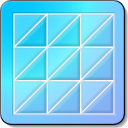
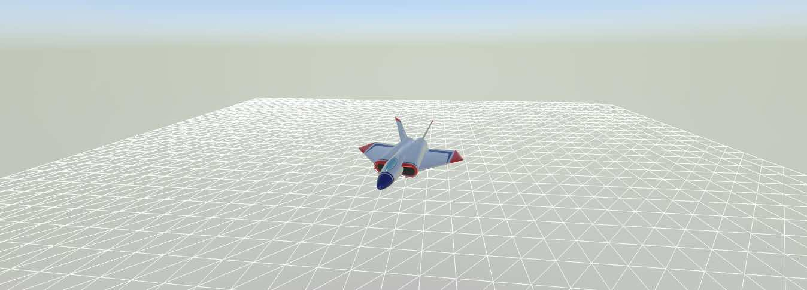

# MFSCNExtensions



Some cool extensions for **SceneKit** frameworks

## Utils

### MFSCNCameraManager

Camera switch helper. 

### MFSCNTextureAccessor

Texture images loader

## MFGridMesh

### Usage:

Example code from the demo project:
<https://github.com/moosefactory/MFGridMeshLab>

#### Add a mesh object

To quickly try the mesh object, create a new multiplatform SceneKit based game project,
you know, the one with the forever rotating plane.

Then do as following to add a simple square mesh node:

```

// Add a mesh node ( must import MFSCNExtension and MFGridUtils )

// 1 - Create a grid object
let grid = MFGrid(gridSize: 40, cellSize: 2)

// 2 - Create a mesh using the grid
let meshNode = MFSCNGridMeshNode(grid: grid)

// 3 - Slightly move the mesh down so wee see it in perspective
meshNode.position.y = -3.0

sceneRenderer.scene = scene

```

Build and run.




### MFSCNGridMeshNode

A Mesh scene kit node. 

### MFSCNElementDataBuffer

Buffer helper.

### MFSCNMeshBuffer

The Mesh Buffer is responsible of allocating and dealing with raw buffers.

### MFSCNMeshBuffer

The library main file

### MFSCNGridMeshGeometry

Builds SceneKit nodes using a MFSCNMeshBuffer

### MFSCNGridMesh+MeshInfo

The structures passed to the Mesh object to set its properties:

#### MFSCNGridMesh+TextureInfo
#### MFSCNGridMesh+HeightMapInfo
#### MFSCNGridMesh+GridInfo

--

*©2024 Moose Factory Software*
